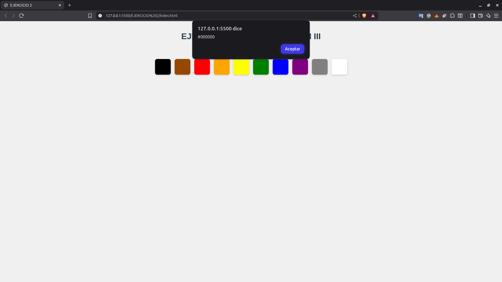
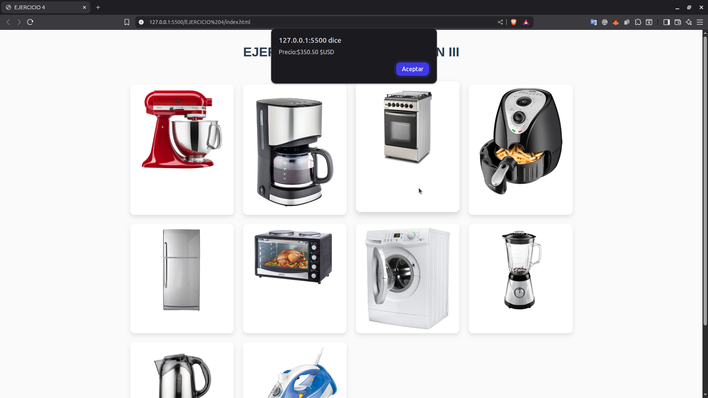
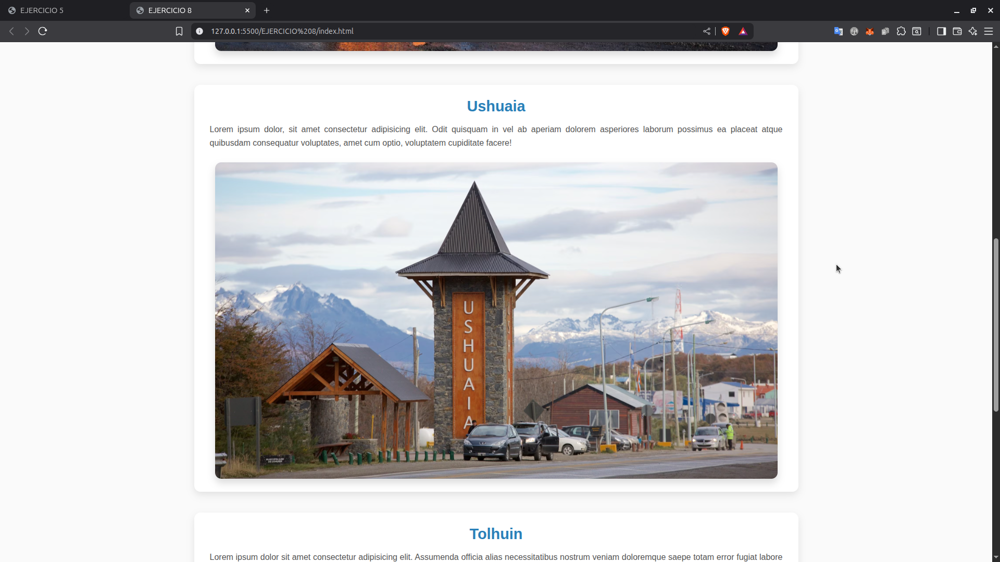

# 📘 Proyecto: Ejercicios Prácticos HTML, CSS y JS

Este repositorio contiene una serie de ejercicios prácticos desarrollados con **HTML, CSS y JavaScript**, aplicando los conocimientos adquiridos durante mi formación como programador. Cada ejercicio está diseñado para fortalecer conceptos fundamentales del desarrollo web y mejorar mis habilidades en la creación de sitios web funcionales.
Además, se incluyen recursos complementarios y capturas de pantalla que ilustran cada práctica realizada.

---

## 📁 Estructura del repositorio
```bash
html-css-js/
├── ejercicios/
│   ├── docs/         # Guia de Ejercicios
│   │   └── Ejercicios-html-css-js.pdf
│   ├── img/          # Capturas de pantalla de los ejercicios
│   ├── ejercicio1/
│   ├── ejercicio2/
│   └── ...
├── img_nea/          # Imagenes de muestra NEA
├── NEA/              # Pagina web basica
└── README.md
```
## 📄 Guía de ejercicios

📘 [Ver guía en PDF](./ejercicios/docs/Ejercicios-html-css-js.pdf)

> La guía contiene instrucciones paso a paso para cada ejercicio realizado.

---

## ✅ Lista de Ejercicios con Capturas

### 



---

### 




---

### 



---

✏️ *Las capturas de los ejercicios restantes se encuentran en la carpeta `/ejercicios/img`.*

---

## 🚀 Objetivos de la Practica

- Reforzar los fundamentos de HTML, CSS y JS mediante ejemplos prácticos  
- Documentar el proceso de aprendizaje con buenas prácticas  

---

## 🙌 Autor

**Robinson**  
